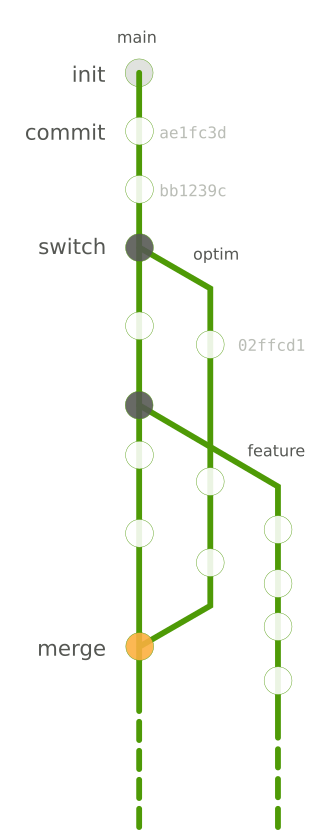
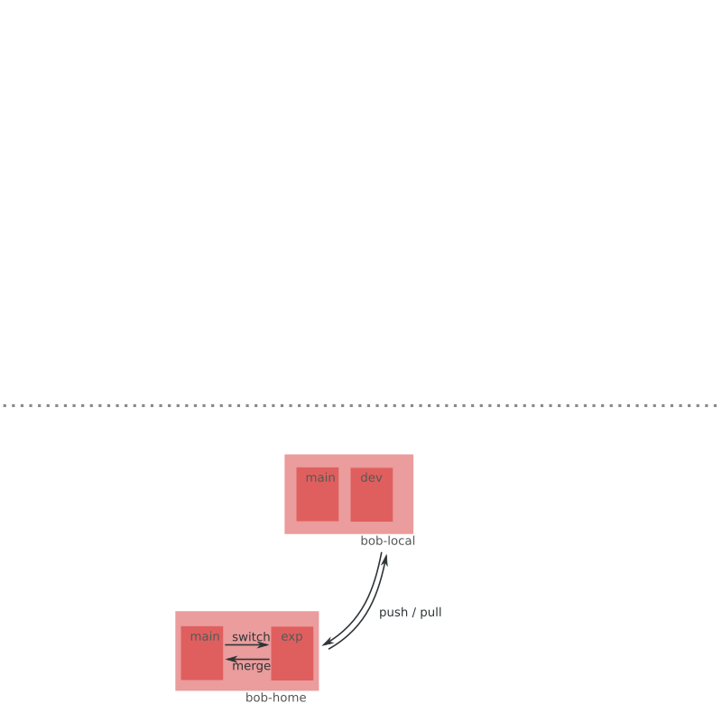
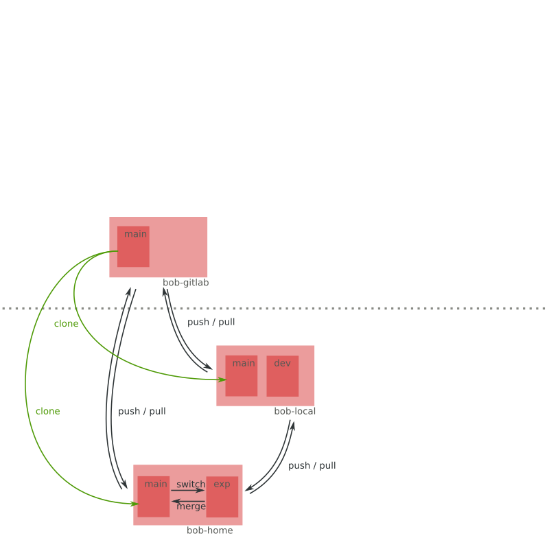
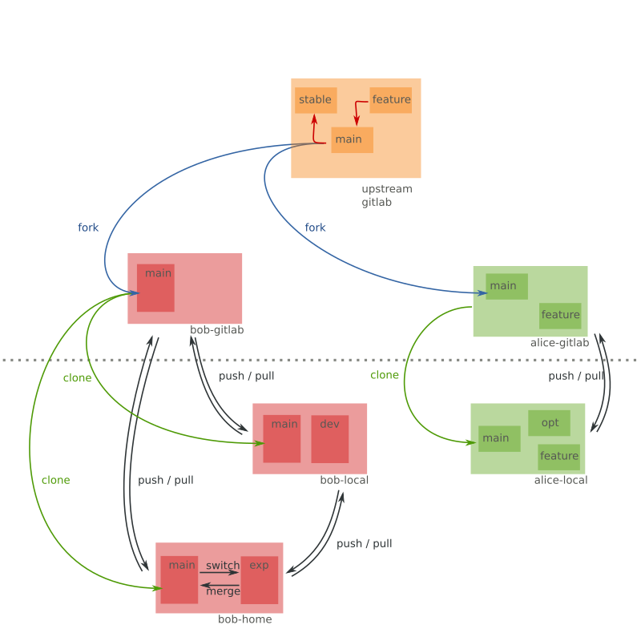
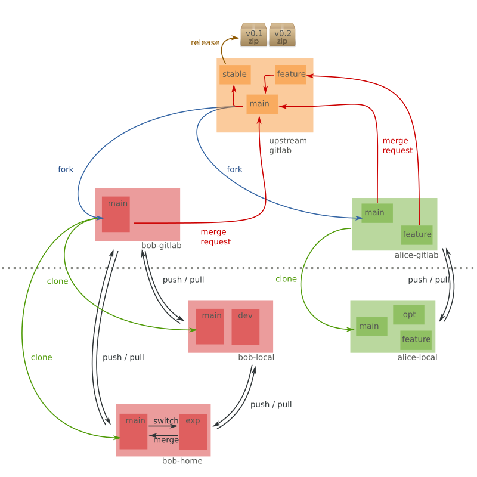

---
title: Howto git
author: Guillaume Gay, CENTURI multi-engineering
susbtitle: How I learned to stop worrying (about my code)
logo: images/logo.png
fontsize: 8pt
width: 1080
height: 800
theme: solarized
data-transition: none
center: 0
...


## Obligatory XKCD


# Outline

## Git as a single user

1. Getting started

2. Git as an archive

3. How to revert mistakes

4. Branches and forks

-------

## Github and Gitlab, multi-user collaboration

0. Backing up to [github](https://github.com)

1. pull requests

2. Issues and bug reports

3. introduction to Continuous Integration


# git as a single user

## Getting started

### 1. Install git


- Linux: `sudo yum install git` or `sudo apt install git`

- Mac OS X: `brew install git` or visit [git-scm.com/download/mac](https://git-scm.com/download/mac)

- Windows: visit [git-scm.com/download/win](https://git-scm.com/download/win) and install the `.exe`


-------


### 2. Install a GUI (optional)


- [Github Desktop](https://desktop.github.com/) (Win & Mac, open-source)
- [Git Kraken](https://www.gitkraken.com/) (Win, Mac& Linux, free but not OSS)

--------

### 3. Configure your name and email

In a terminal ("git bash" on Windows)

```sh
git config --global user.name "Guillaume Gay"
git config --global user.email "guillaume.gay.1@univ-amu.fr"
```


--------

### 4. Create your first project

- Create a directory (called e.g. `Documents/GitTuto`)
- in the terminal `cd` to that directory:

:::::::::::::: {.columns}
::: {.column}
#### Bash

```sh
cd Documents/GitTuto
```
:::
::: {.column}
#### DOS

```sh
cd C:\User\Guillaume\Documents\GitTuto
```
:::
::::::::::::::

- The directory is empty:

:::::::::::::: {.columns}
::: {.column}
```sh
ls -la
```
:::
::: {.column}
```sh
dir
```
:::
::::::::::::::

--------

- Tell git to start tracking this dir

```sh
git init
```

. . .

- Now the directory isn't empty

::::::::::: {.columns}
::: {.column}
```sh
ls -la
tree .git/
```
:::
::: {.column}
```sh
dir
```
:::
:::::::::::

. . .

_You can do this on an existing directory_


-------

> The `.git` directory contains _all_ git needs to track your project

::: incremental

* It is safe to copy or move the whole directory

* **!!** `.git` might contain lots of small files

* **!!** Delete `.git` → lose history

:::

-------

To know what is going on at any time, type:

```sh
git status
```


## git as an archive manager

-----


#### **`git add`**


. . .

- Create a (text) file, e.g. `README.md`
- Write "This is a git tutorial" in it.

. . .

```sh
git status
```

. . .

```sh
git add README.md
```

. . .

```sh
git status
```

. . .


_Now git knows about your file_


-----

#### **`git commit`**

. . .


```sh
git commit -am "My first commit"
```
_The message is mendatory_

```sh
git status
```

. . .

_Git registered your file_

-----

Edit README.md (add a some text) and

```sh
git status
```

You can see there are untracked changes

. . .


```sh
git commit -am "My second commit"
```

```sh
git status
```

Your changes were registered _(wash, rince, repeat)_

----

#### Other usefull stuff:


- `log`: what happened before now

```sh
git log
```

. . .

- `diff`: show what changed

Edit README.md again and do

```sh
git diff
```


-----

* The `.gitignore` file allows to avoid tracking certain files (build, automated backups, etc.)

. . .

* Create a file called `tmp_file.txt`

```sh
git status
```

* Create a file called `.gitignore` and write `tmp_*` in it

```sh
git status
```


_It's good to have a direct read of the state of your code (in your editor or terminal)_


-------

## how to cancel and revert mistakes

{ height=200px }

There are two commands depending on your git freshness

:::::::::::: {.columns}
::: {.column width=50%}

_older git_ ( before 2.23 )

```sh
git checkout README.md
```
:::
::: {.column width=50%}

_newer git_ ( after 2.23 )

```sh
git restore README.md
```

:::
:::::::::::::::::::::::::::

Those undo changes made since latest commit

-----------

> You can restore older versions of the file and do much more

See

```sh
git restore --help
```

For exemple to restore a file at a certain commit, you can reference this commit by its _hash_:

```sh
git restore -s ae2fd12 README.md
```

You can find a commit's hash with `git log`


----------

You can also move the whole directory to a previous version with

```sh
git reset --hard ae2fd12
```

> **!!** Can erase history **!!**

or undo a commit with

```sh
git revert 1ecf342
```

_I don't do that much_

. . .

> There are plenty of more powerfull things you can do, but I don't know / need them!


## Branches and how to merge them (2nd session)



. . .

> branches are cheap, use them!


# Github and Gitlab

## Backing up to [github](https://github.com)

1. Create an account

2. Manage SSH

git communicates with public / private keys. To make it easier, we register a key on our github account.

```sh
ssh-keygen # creates a key
```

On github, go to settings > SSH and GPG Keys > New SSH key

Copy the content of `.ssh/id_rsa.pub` there.


---------

### Local to distant

- Create a new (empty) "GitTuto" repository on github

- Copy the repo URL

- Declare it as a **remote**

```sh
git remote add origin git@github.com/glyg/GitTuto.git
```

- Publish your repo to github

```sh
git push origin main
```

-------

### Distant to local

- Delete your local directory

. . .

- In the parent directory:

```sh
git clone git@github.com/glyg/GitTuto.git
```

```sh
git status
git remote show origin
```

. . .

- Make a change and commit it, then

```sh
git push
```

----------

- Make a change on README.md on github

```
git status
git remote show origin
git pull
git status
```


## One user, several repositories



-------

## One user, several repositories



-------

## Two users, several repositories


-------

## Two users, several repositories




-------

## Two users, several repositories



# Issues

* Do not hesitate to report problems

* Be polite etc.

* Use issues to discuss and track _your_ problems

* What's [a minimal reproducible example](https://github.com/numpy/numpy/issues/16909)?


# A word on Continuous Integration


* Automates tests

* No more 'but it works on my machine :/'

* Can be tricky to setup

---------------

###  Questions, comments, suggestions:
 [github.com/centuri-engineering/git_tuto](https://github.com/centuri-engineering/git_tuto)

<p style="margin-bottom: 100px"></p>

### Slack Channel:

 [centuri-livingsystems.org/multi-engineering-platform](https://centuri-livingsystems.org/multi-engineering-platform)
