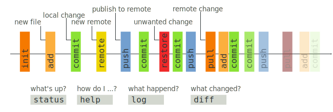

---
title: Howto git
author: Guillaume Gay, CENTURI multi-engineering
susbtitle: How I learned to stop worrying (about my code)
logo: images/logo.png
fontsize: 8pt
width: 1080
height: 800
theme: solarized
data-transition: none
center: 0
...

# Outline

## Git as a single user

1. Getting started

2. Git as an archive

3. How to revert mistakes

4. Backing up to [github](https://github.com)

-------

## Github and Gitlab, multi-user collaboration

0. Branches and forks

1. pull requests

2. Issues and bug reports

3. introduction to Continuous Integration


# git as a single user

## Getting started


------

### 1. Install git


- Linux: `sudo apt install git`

- Mac OS X: [git-scm.com/download/mac](https://git-scm.com/download/mac)

or `brew install git`

- Windows:  [git-scm.com/download/win](https://git-scm.com/download/win)

-------


### 2. Install a GUI (optional)


- [Github Desktop](https://desktop.github.com/) (Win & Mac, open-source)
- [Git Kraken](https://www.gitkraken.com/) (Win, Mac& Linux, free but not OSS)

--------

### 3. Configure your name and email

In a terminal ("git bash" on Windows)

```sh
git config --global user.name "Guillaume Gay"
git config --global user.email "guillaume.gay.1@univ-amu.fr"
```


--------

### 4. Create your first project

- Create a directory (called e.g. `GitTuto`)
- in the terminal `cd` to that directory:

```sh
cd GitTuto
```

- The directory is empty:

```sh
ls -la
```

--------


- Tell git to start tracking this dir

```sh
git init
```

. . .

<video width="800" height="600" controls>
  <source src="images/git_tuto_00.avi" type="video/mp4">
</video>


-------

> The `.git` directory contains _all_ git needs to track your project

::: incremental

* **!!** `.git` might contain lots of small files

* **!!** Delete `.git` → lose history

* You can move the whole directory (with the `.git` subdir.)

* You can do `git init` on an existing directory (only once)

:::

-------

#### **`status`**


To know what is going on at any time, type:

```sh
git status
```


## git as an archive manager

-----


#### **`add`**


. . .

- Create a (text) file, e.g. `README.md`
- Write "This is a git tutorial" in it.

<video width="800" height="600" controls>
  <source src="images/git_tuto_01.avi" type="video/mp4">
</video>


------

Add the file to your git "ledger"


. . .

```sh
git add README.md
```

<video width="800" height="600" controls>
  <source src="images/git_tuto_02.avi" type="video/mp4">
</video>

. . .

_Now git knows about your file_


-----

#### **`commit`**

. . .


```sh
git commit -am "My first commit"
```
_The message is mendatory_

. . .

<video width="800" height="600" controls>
  <source src="images/git_tuto_03.avi" type="video/mp4">
</video>

_Git registered your file_

-----


#### **`diff`**

Modify README.md, `git status` shows there are untracked changes and  `git diff` shows what changed.

<video width="800" height="600" controls>
  <source src="images/git_tuto_04.avi" type="video/mp4">
</video>

. . .

Your changes were registered _(wash, rince, repeat)_

----

#### **`log`**


`git log` tells you what happened before now

<video width="800" height="600" controls>
  <source src="images/git_tuto_05.avi" type="video/mp4">
</video>

. . .

Each commit is identified by its hash (e.g. `81cd7`)


-----

#### **`.gitignore`**

* Create a file called `tmp_file.txt`

```sh
git status
```

. . .


* Create a file called `.gitignore` and write `tmp_*` in it.


Only .gitignore is listed as untracked


-------

## how to cancel and revert mistakes

{ height=200px }

There are two commands depending on your git freshness

:::::::::::: {.columns}
::: {.column width=50%}

_older git_ ( before 2.23 )

```sh
git checkout README.md
```
:::
::: {.column width=50%}

_newer git_ ( after 2.23 )

```sh
git restore README.md
```

:::
:::::::::::::::::::::::::::

Those undo changes made since latest commit

-----------

You can restore older versions of the file.


For exemple to restore a file at a certain commit, you can reference this commit by its _hash_:

```sh
git restore -s ae2fd12 README.md
```

You can find a commit's hash with `git log`

----------

#### In closing

> It's good to have a direct read of the state of your code (in your editor or terminal)


> There are plenty of more powerfull things you can do, but I don't know / need them!


## Backing up to [github](https://github.com)

1. Create an account

2. Manage SSH

git communicates with public / private keys. To make it easier, we register a key on our github account.

```sh
ssh-keygen # creates a key
```

On github, go to settings > SSH and GPG Keys > New SSH key

Copy the content of `.ssh/id_rsa.pub` there.

---------

### Local first

#### **`remote add`**


- Create a new (empty) "GitTuto" repository on github

- Copy the repo URL

- Declare it as a **remote**

```sh
git remote add origin git@github.com/glyg/GitTuto.git
```

. . .

- Change your principal branch from `master` to `main`

```sh
git branch -M main
```

----------

#### **`push`**

- Publish the local files to github

```sh
git push -u origin main
```
. . .

Make new changes, commit and push

```sh
git commit -am "changed README.md"
git push
```

-----

#### **`pull`**


- Make a change on README.md on github & commit there

```
git pull
git log
```

-------


### Distant first

#### **`clone`**


- In another place on your computer (or on another computer):

```sh
git clone git@github.com/glyg/GitTuto.git
cd GitTuto
```

```sh
git status
git remote show origin
```

## Summary




## Branches and how to merge them (2nd session)


. . .

> branches are cheap, use them!


# Collaboration with Github and Gitlab


## One user, several repositories


-------

## One user, several repositories


-------

## Two users, several repositories


-------

## Two users, several repositories


-------

## Two users, several repositories


# Issues

* Do not hesitate to report problems

* Be polite etc.

* Use issues to discuss and track _your_ problems

* What's [a minimal reproducible example](https://github.com/numpy/numpy/issues/16909)?


# A word on Continuous Integration


* Automates tests

* No more 'but it works on my machine :/'

* Can be tricky to setup

---------------

###  Questions, comments, suggestions:
 [github.com/centuri-engineering/git_tuto](https://github.com/centuri-engineering/git_tuto)

<p style="margin-bottom: 100px"></p>

### Slack Channel:

 [centuri-livingsystems.org/multi-engineering-platform](https://centuri-livingsystems.org/multi-engineering-platform)
