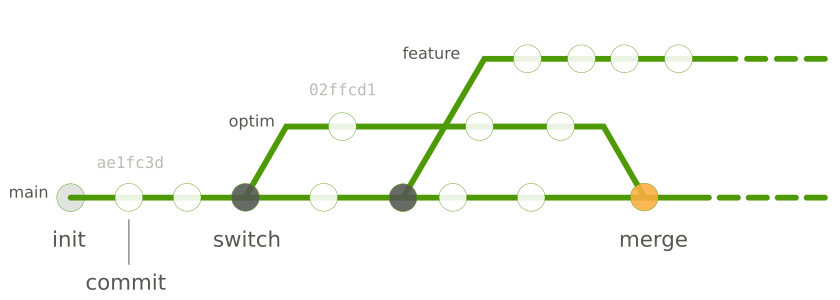
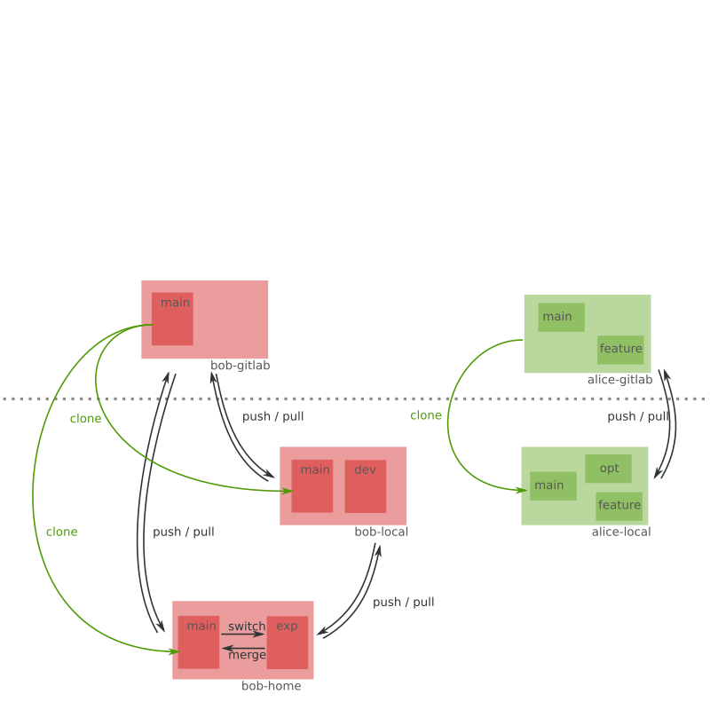

---
title: Howto git
author: Guillaume Gay, CENTURI multi-engineering
susbtitle: How I learned to stop worrying (about my code)
logo: images/logo.png
fontsize: 10pt
width: 1080
height: 800
theme: solarized
data-transition: none
...


# Obligatory XKCD


# Outline

## git as a single user

1. git as an archive: `add`, `commit`

2. branches and how to merge them: `switch`, `merge`, `mergetool`

3. how to cancel and revert mistakes: `restore`, `reset`

-------

## Github and Gitlab, multi-user collaboration

1. one user, several forks: `pull`, `push`

2. pull requests

3. Issues and bug reports

4. introduction to Continuous Integration


# git as a single user


## git as an archive

- `add`: I want to track this change (put it in the **index**)
- `commit`: please register the state of my code, with that message

Other usefull commands:

- `status`: how is my project (new files, untracked changes, deleted files, ...)
- `log`: what happened before now


-------

## structure & configuration

:::::::::::::: {.columns}
::: {.column width="30%"}

:::
::: {.column width="70%"}

- `.gitignore` to avoid tracking certain files (build, automated backups, etc.)

- good to have a direct read of the state of your code (in your editor or terminal)

- add user and email

```
git config --global user.name "Guillaume Gay"
git config --global user.email "guillaume.gay.1@univ-amu.fr"
```

:::
::::::::::::::


## branches and how to merge them



> branches are cheap, use them!

## how to cancel and revert mistakes


- `restore` : go back to a previous version of the file, undelete, etc.
- how to refer to previous versions?


# Github and Gitlab

## One user, several repositories


-------

## One user, several repositories


-------

## One user, several repositories


-------

## Two users, several repositories



-------

## Two users, several repositories


-------

## Two users, several repositories


# Issues

* Do not hesitate to report problems

* Be polite etc.

* Use issues to discuss and track _your_ problems

* What's [a minimal reproducible example](https://github.com/numpy/numpy/issues/16909)?


# A word on Continuous Integration


* Automates tests

* No more 'but it works on my machine :/'

* Can be tricky to setup

---------------

###  Questions, comments, suggestions:
 [github.com/centuri-engineering/git_tuto](https://github.com/centuri-engineering/git_tuto)

<p style="margin-bottom: 100px"></p>

### Slack Channel:

 [centuri-livingsystems.org/multi-engineering-platform](https://centuri-livingsystems.org/multi-engineering-platform)
